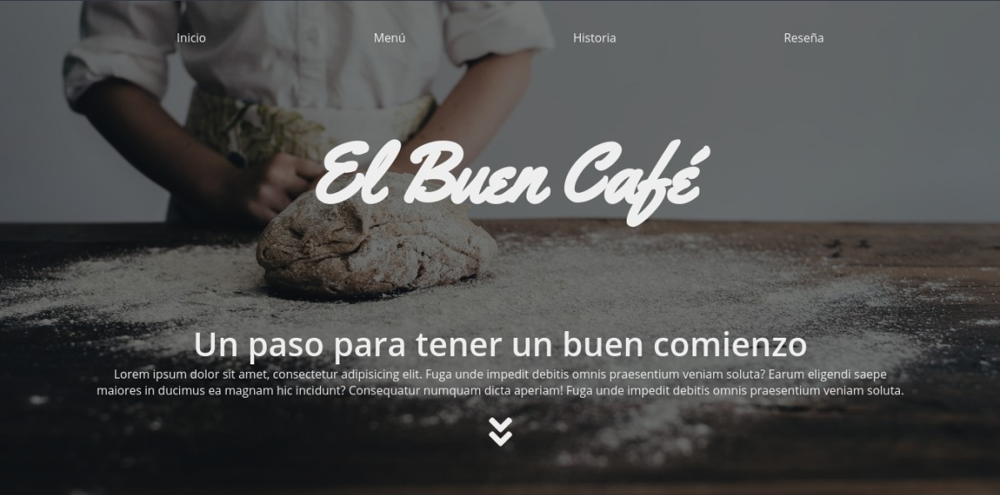

# El Buen Café

Este es uno de los primeros proyectos que hice con HTML, CSS y JavaScript.

Es una página estática de una cafetería que muestra los productos generales que se venden.

## Contenido

### Sitio

[ElBuenCafe.link](https://el-buen-cafe.netlify.app/)

### Tecnologias utilizadas

- HTML
- CSS
- JavaScript
